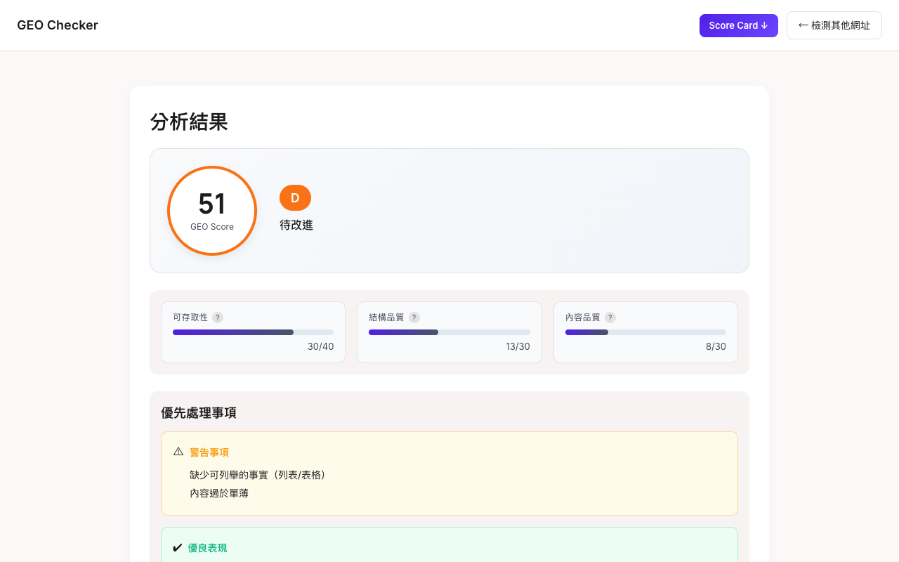

# GEO Checker

> SEO helps content get found. GEO ensures content gets interpreted correctly.


**GEO (Generative Engine Optimization) Checker** analyzes how well your content is understood by AI search engines like ChatGPT, Claude, Perplexity, and Google AI Overviews.

**Live demo: [gc.ranran.tw](https://gc.ranran.tw)**

## Why GEO matters

SEO optimizes for search engine *ranking*. But when ChatGPT or Perplexity answers a question, they don't rank pages — they **interpret, summarize, and cite** content. If your page isn't structured for AI comprehension, you're invisible to the next generation of search.

GEO Checker tells you exactly what to fix.

## Features

- **14 AI Crawler Detection** — GPTBot, ClaudeBot, PerplexityBot, Google-Extended, Applebot, Meta AI, and 8 more
- **GEO Signal Analysis** — E-E-A-T authority, content freshness, image alt text quality, llms.txt, Schema.org structured data
- **AI Citation Simulator** — Preview how AI engines would summarize and cite your content
- **GEO Score Card** — Shareable visual score card (1200x630 OG image)
- **Compare Mode** — Side-by-side analysis of multiple pages
- **Action Toolkit** — Fix checklist, robots.txt generator, Schema.org generator
- **Multilingual** — Full English and Traditional Chinese support



## Quickstart

### Use the hosted version

Visit **[gc.ranran.tw](https://gc.ranran.tw)** — no installation needed.

### Run locally

```bash
git clone https://github.com/MakiDevelop/geo-checker.git
cd geo-checker
pip install -r requirements.txt
python -m spacy download en_core_web_sm

# Web UI
uvicorn app.main:app --host 0.0.0.0 --port 8000
# → http://localhost:8000

# CLI
python -m src.main run https://example.com
```

### Run with Docker

```bash
docker compose up -d
# → http://localhost:8000
```

## Architecture

```
URL input
  │
  ├─ src/fetcher/     → Fetch HTML
  ├─ src/parser/      → Extract main content
  ├─ src/seo/         → Mechanical SEO checks
  ├─ src/geo/         → AI readability & risk heuristics
  ├─ src/ai/          → LLM citation simulation
  └─ src/report/      → Format output (CLI/JSON/Markdown)
```

- **CLI-first, fully local** — no data leaves your machine
- **Web UI** — FastAPI-powered dashboard for visual analysis
- **Docker-ready** — one command to deploy

## Tech Stack

| Component | Choice |
|-----------|--------|
| Backend | FastAPI + Python 3.11+ |
| NLP | spaCy (entity extraction) |
| Container | Docker + Traefik |
| Frontend | Vanilla HTML/CSS/JS |

## Contributing

Issues and PRs welcome. See [docs/](docs/) for design decisions and RFCs.

## License

MIT
